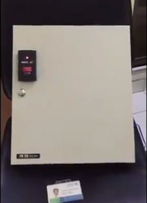
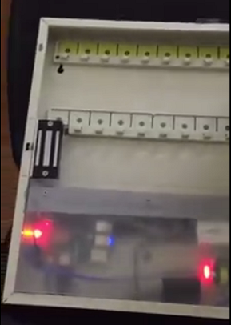

# rfid-lockbox

A lockbox based on Raspberry Pi. Lock/Unlock by tapping the Staff ID card to the RFID reader. Utilized MS/SQL for access management.

------
Locked state of the Lockbox:

Internal of the box when opened:

